# Title

**Difficulty:** Intermediate

**Estimated Time:** 1 hour

**Hardware Needed:** None

---

### Overview

This blueprint shows how to configure an InfluxDB time series database integration.

---

### Tools & Materials

- Particle device (Photon 2, Boron, etc.)
- USB cable
- Particle Workbench or CLI installed

---

### Steps

1. **Create InfluxDB bucket**

   1. Log in or create an account in [InfluxDB](https://www.influxdata.com/)
   2. Create a new data bucket by navigating to the `Buckets` page on the left navigation panel. Make note of the bucket's name you chose.
      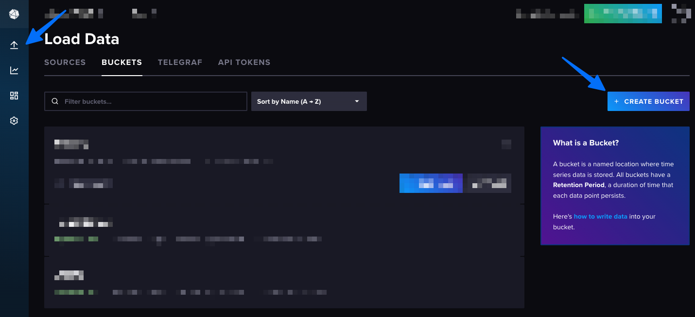
      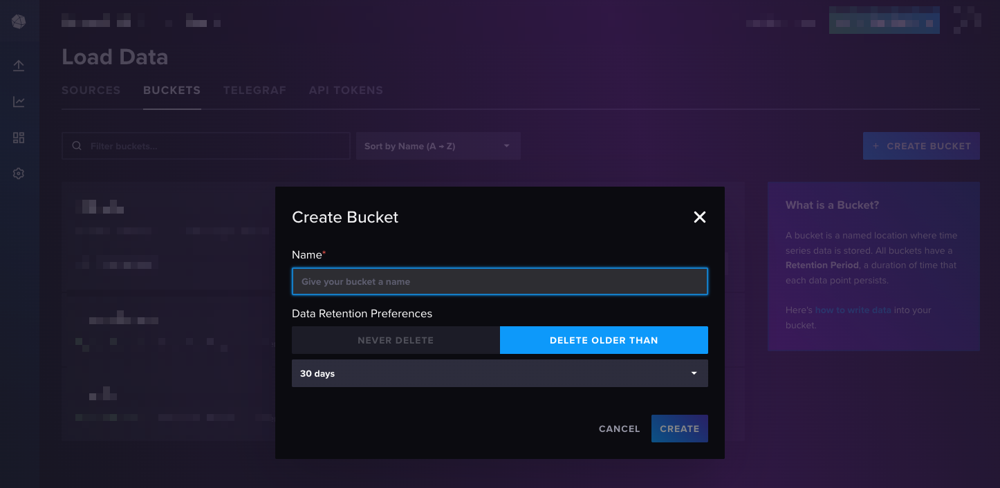

2. **Create InfluxDB API token**

   1. Navigate to API TOKENS and create a new Custom API Token. Make note of the token for later.
      
      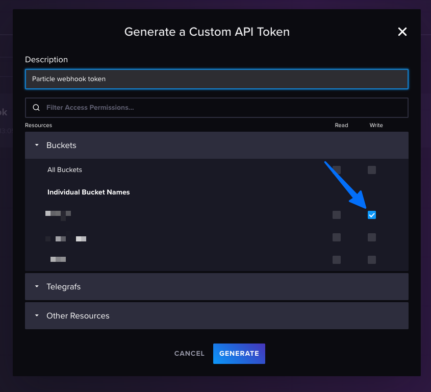

3. **Create Particle Cloud Secret**

   1. Navigate to your Particle console and select `Cloud Services > Cloud Secrets`. Choose "Create new secret". Create a cloud secret for `INFLUX_API_KEY`, `INFLUX_ORG`, and `INFLUX_BUCKET`. These values can be pulled from the previous steps.
      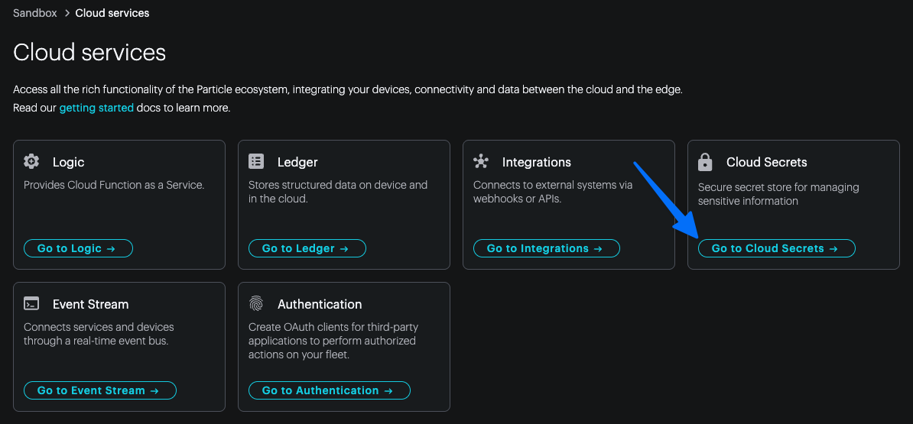
      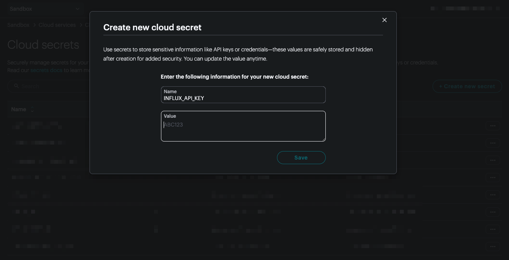

4. **Configure Particle webhook**

   1. Navigate to your Particle console and choose "Go to integrations"
      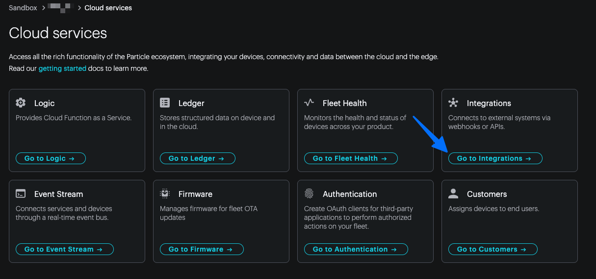
   2. Choose "Add new integration" and find "Custom Webhook".
      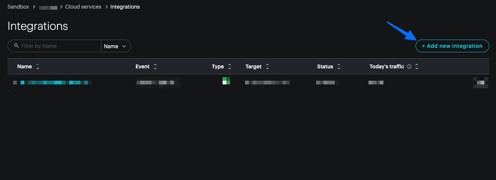
      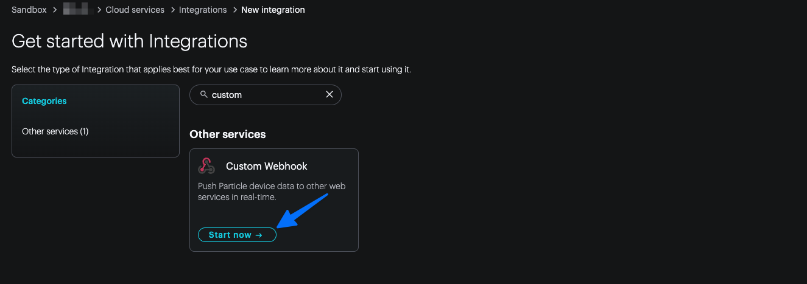
   3. Select the "Custom Template" tab:
      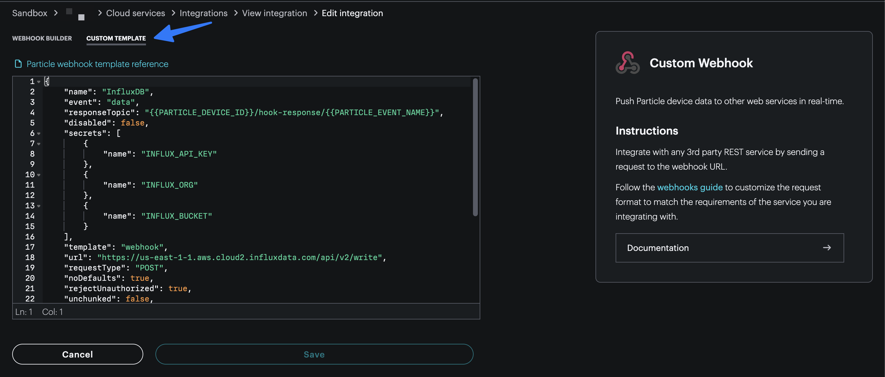
   4. Paste the following template in. Make sure to change the `url` property to match the region your InfluxDB instance (i.e. `us-east-1-1`).

      Note the `body` contents. This uses the [line protocol](https://docs.influxdata.com/influxdb3/core/reference/line-protocol/#Copyright) to fill in the time series data. You can update it according to your application.

      You should also note the `event` key, this requires data to be published to the `data` event stream. Feel free to update this accordingly.

   ```json
   {
     "name": "InfluxDB",
     "event": "data",
     "responseTopic": "{{PARTICLE_DEVICE_ID}}/hook-response/{{PARTICLE_EVENT_NAME}}",
     "disabled": false,
     "secrets": [
       {
         "name": "INFLUX_API_KEY"
       },
       {
         "name": "INFLUX_ORG"
       },
       {
         "name": "INFLUX_BUCKET"
       }
     ],
     "template": "webhook",
     "url": "https://us-east-1-1.aws.cloud2.influxdata.com/api/v2/write",
     "requestType": "POST",
     "noDefaults": true,
     "rejectUnauthorized": true,
     "unchunked": false,
     "data_url_response_event": false,
     "headers": {
       "Content-Type": "text/plain; charset=utf-8",
       "Authorization": "Token {{INFLUX_API_KEY}}"
     },
     "query": {
       "orgID": "{{INFLUX_ORG}}",
       "bucket": "{{INFLUX_BUCKET}}",
       "precision": "s"
     },
     "body": "data,device={{{PARTICLE_DEVICE_ID}}} count={{{count}}} {{{time}}}"
   }
   ```

   5. Test the webhook with the corresponding JSON payload such as: `{"count":42,"time": <epoch>}`. Note that you will likely get a "timeout" warning as the InfluxDB API returns a `204` response while the Particle webhook expects a `200` response, this is OK.
      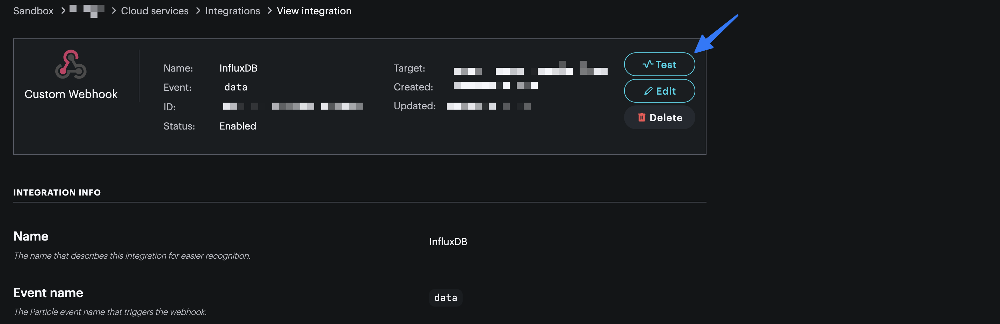
      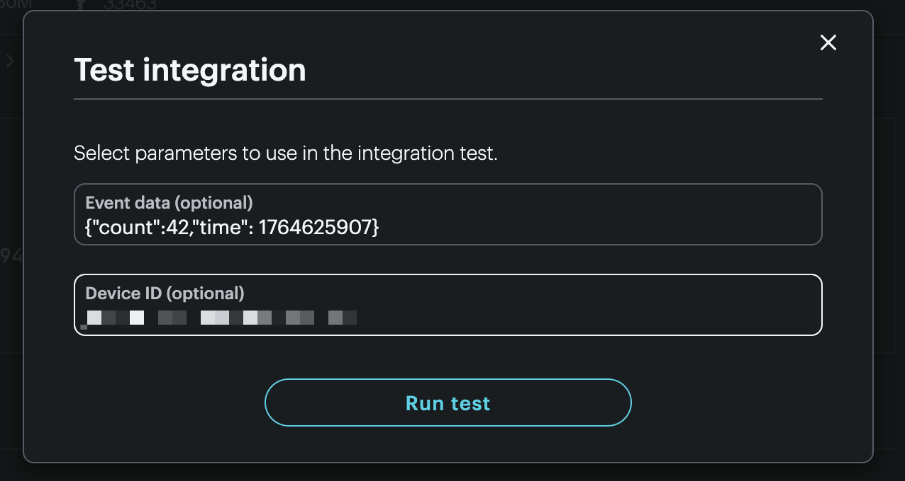
      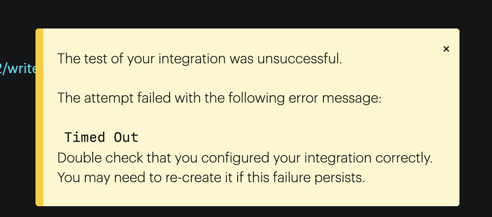

5. **Clone this repository:**

   ```bash
   git clone https://github.com/particle-iot/blueprint-intermediate-influxdb.git
   cd blueprint-intermediate-influxdb
   ```

6. **Open the project** in VSCode with Particle Workbench.

7. **Flash to your device:**

   1. Configure project for your device using Particle Workbench and the command pallette (cmd / ctrl + shift + p):
      
   2. Select your device model and Device OS release:
      
      

8. **Open a serial terminal**:

   1. Open a serial monitor session by choosing `Particle: Serial monitor` from the command pallette:
      

9. **Observe output**

   1. You should now see logs indicating that publishes have succeeded. Each publish to the `data` event stream will trigger the webhook responsible for inserting data into the InfluxDB instance.

      ```
      0000010622 [app] INFO: publish succeeded
      0000040255 [app] INFO: publishing {"count":1,"timestamp":1764701}
      0000040879 [app] INFO: publish succeeded
      0000070255 [app] INFO: publishing {"count":2,"timestamp":1764701}
      0000070928 [app] INFO: publish succeeded
      0000100255 [app] INFO: publishing {"count":3,"timestamp":1764701}
      ```

10. **Confirm in InfluxDB**

    1. Navigate back to your InfluxDB Data Explorer to view the new time series data as it streams in:
       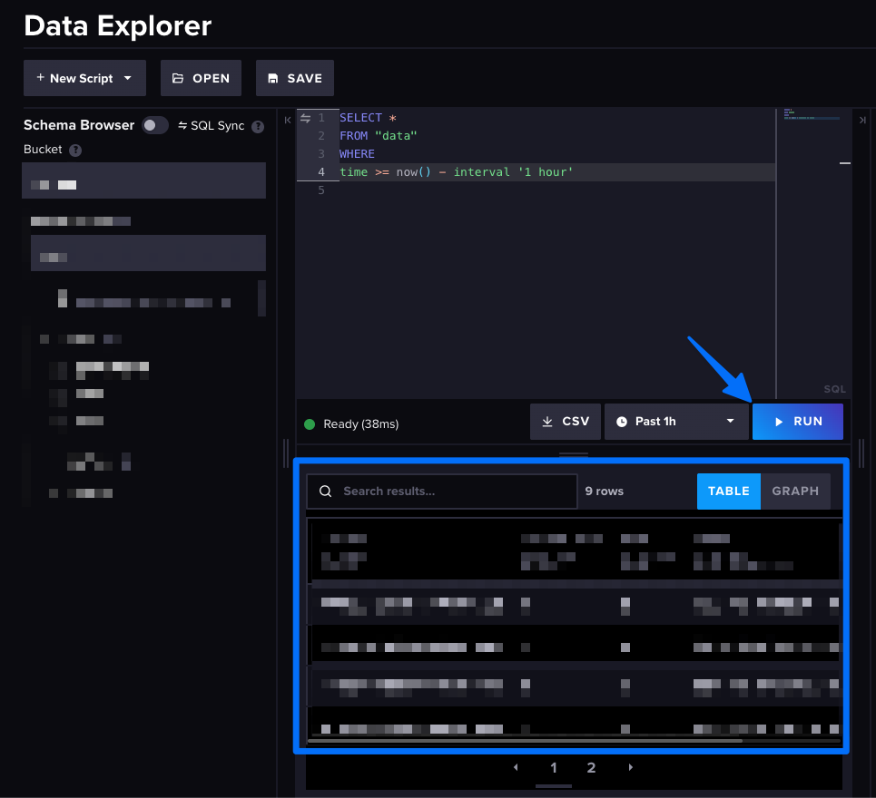

---

### How It Works

The firmware periodically publishes a JSON object with `count` and `timestamp` keys using the `CloudEvent` API. The payload can be modified, however, the webhook integration must also be modified.

```cpp
particle::Variant obj;
obj.set("count", count);
obj.set("timestamp", Time.now() / 1000);

event.name("data");
event.data(obj);
Particle.publish(event);
```

The default rate is once per minute, however this can be modified by updating the `publishPeriod` variable.

---

### Topics Covered

List the Particle APIs and features demonstrated. Add links pointing to their documentation.

- [Extended publish](https://docs.particle.io/reference/device-os/typed-publish/)
- [Particle integrations](https://docs.particle.io/integrations/introduction/)

---

### Extensions

Try extending this stream with a sensor reading such as from the [Muon's onboard temperature sensor](https://github.com/particle-iot/blueprint-intermediate-temperature-ledger).
